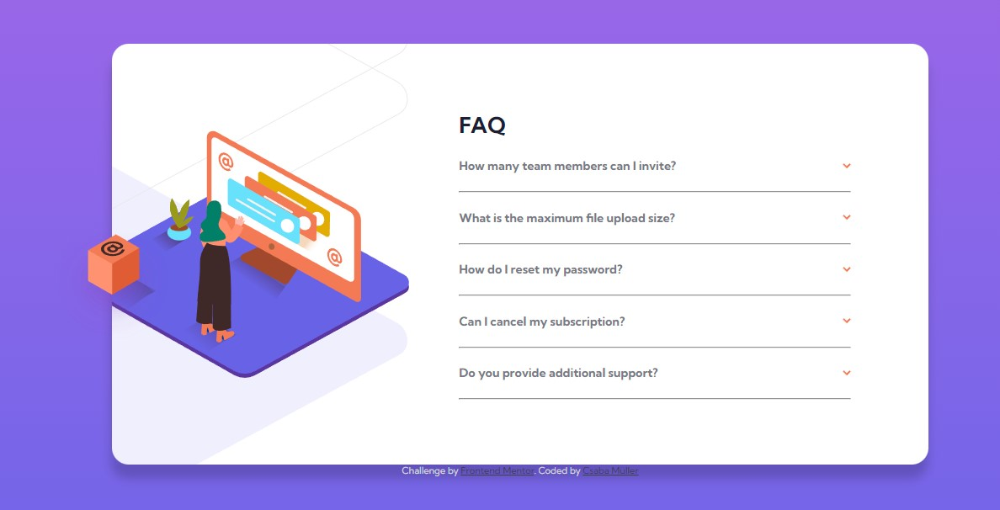

# Frontend Mentor - FAQ accordion card solution

This is a solution to the [FAQ accordion card challenge on Frontend Mentor](https://www.frontendmentor.io/challenges/faq-accordion-card-XlyjD0Oam). Frontend Mentor challenges help you improve your coding skills by building realistic projects. 

### Screenshot

### Links

- Solution URL: [GitHub](https://github.com/Csabooo/frontendmentor-07_faq-accordion-card-main)
- Live Site URL: [GitHub Pages](https://csabooo.github.io/frontendmentor-07_faq-accordion-card-main/)

## My process

### Built with

- Semantic HTML5 markup
- CSS custom properties
- Flexbox
- Mobile-first workflow

## Author

- Website - [Portfolio](https://csabooo.github.io/portfolio/)
- Frontend Mentor - [@Csabooo](https://www.frontendmentor.io/profile/Csabooo)

